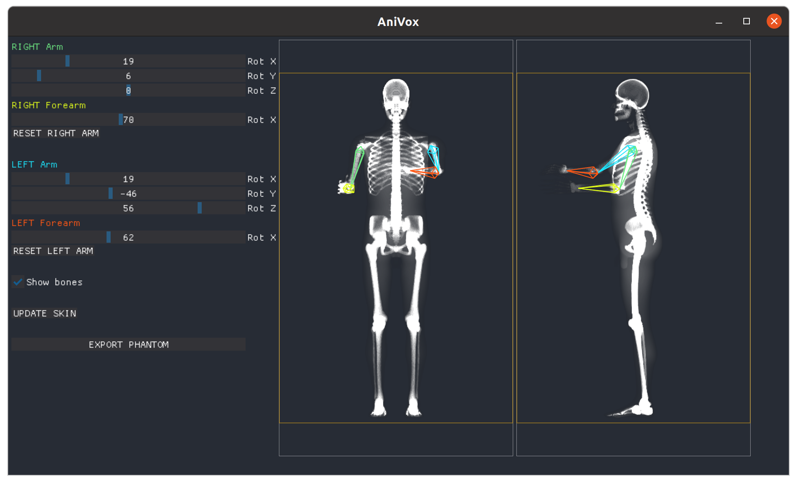

AniVox

Fast animated voxelized phantom for Monte Carlo simulation

[](https://shields.io/)

### Screenshot



### Requirements

 ---
 
* pip 22.0.4
* dearpygui 1.4.0
* screeninfo 0.8
* numpy 1.21.5
* simpleitk 2.1.1
* numba 0.55.1

### Installation

---

```sh
python3.8 -m venv venv
source ./venv/bin/activate
python -m pip install --upgrade pip
pip install -r requirements.txt
```